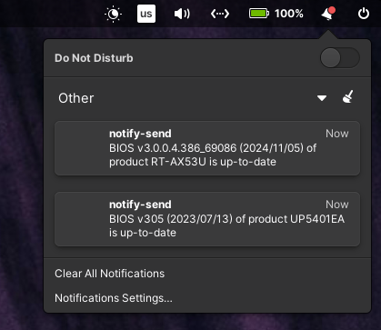

# Asus BIOS Updates Notifier

[](https://www.gnu.org/licenses/old-licenses/gpl-2.0.en.html)

[](https://github.com/asus-linux-drivers/asus-bios-updates-notifier/releases)
[](https://GitHub.com/asus-linux-drivers/asus-bios-updates-notifier/commit/)
[](https://github.com/asus-linux-drivers/asus-bios-updates-notifier/issues/new/choose)
[](http://makeapullrequest.com)
[](https://hits.seeyoufarm.com)



Included script checks every time when laptop starts whether is BIOS version of current ASUS laptop and each ASUS product defined manually in associated config up-to-date. Is used systemctl service.

If you find this project useful, do not forget to give it a [](https://github.com/asus-linux-drivers/asus-bios-updates-notifier/stargazers) People already did!

## Changelog

[CHANGELOG.md](CHANGELOG.md)

## Features

- Notifier is installed for current user and does not run under `$ sudo`
- Customizable scripts which by default show notification bubbles via `$ notify-send`
- Via config is possible check BIOS version of any Asus product

## Installation

Get latest dev version using `git`

```bash
$ git clone https://github.com/asus-linux-drivers/asus-bios-updates-notifier
$ cd asus-bios-updates-notifier
```

and install

```bash
$ bash install.sh
```

or run separately parts of the install script

- run notifier every time when the user log in (do NOT run as `$ sudo`, works via `systemctl --user`)

```bash
$ bash install_service.sh
```

## Configuration

Config file with Asus products is located here `/usr/share/asus-bios-updates-notifier/config.ini`. BIOS of the current laptop is checked automatically and do not has to be added in config! (format below)

```
"RT-AX53U"="3.0.0.4.386_69086"
```

When is systemctl service installed check script is run immediately and also is run every time when user log in and after every BIOS version check are processed scripts that are located for futher customization here:

- When is BIOS upgradable (`/usr/share/asus-bios-updates-notifier/bios_is_upgradable_script.sh`)(default content below)

```
#!/usr/bin/env bash

notify-send "BIOS v$BIOS_VERSION of product $BIOS_PRODUCT_NAME is upgradable to v$BIOS_VERSION_LATEST ($BIOS_VERSION_LATEST_RELEASED_DATE)"
```

- When is BIOS up-to-date (`/usr/share/asus-bios-updates-notifier/bios_is_uptodate_script.sh`) (default content below)

```
#!/usr/bin/env bash

notify-send "BIOS v$BIOS_VERSION ($BIOS_VERSION_LATEST_RELEASED_DATE) of product $BIOS_PRODUCT_NAME is up-to-date"
```

## Uninstallation

To uninstall run

```bash
$ bash uninstall.sh
```

or run separately parts of the uninstall script

```bash
$ bash uninstall_service.sh
```

## Tests

To run tests

```bash
$ bash tests/script.sh
```

## Existing similar projects

I do not know any.

**Why was this project created?** As a notifier about any released BIOS versions.
